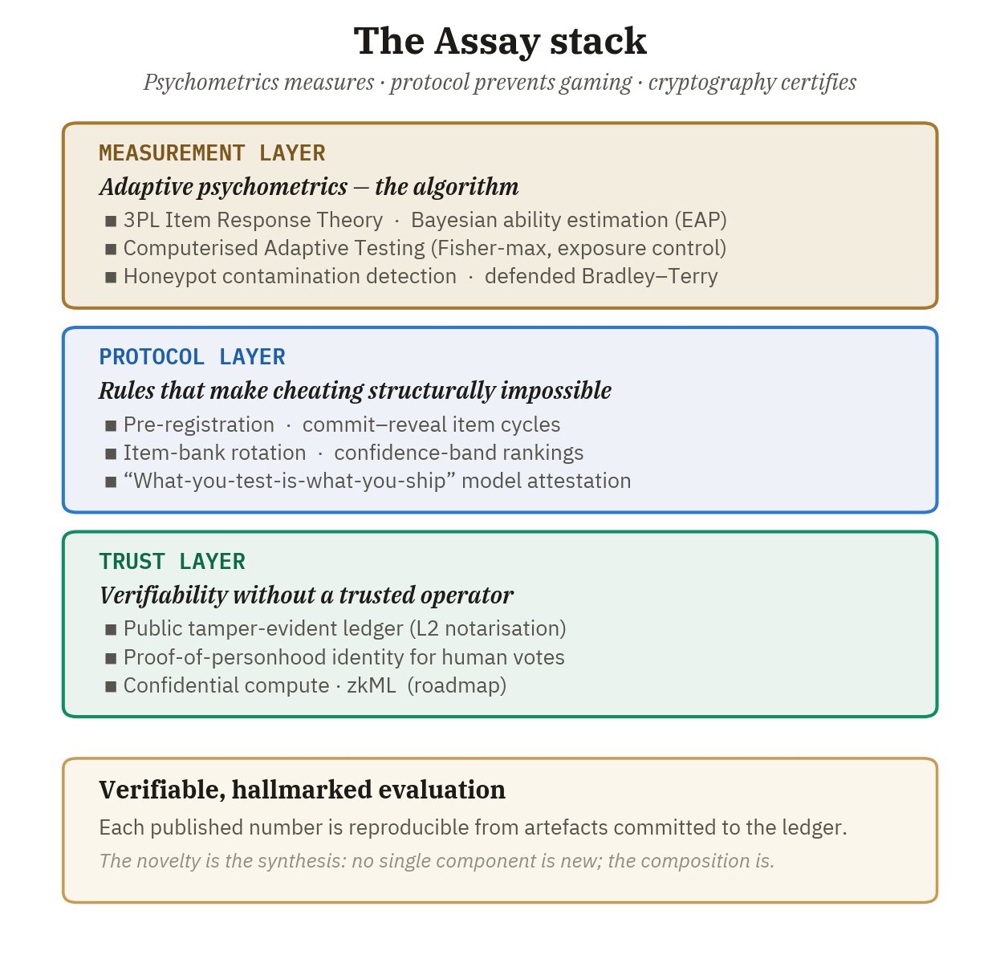
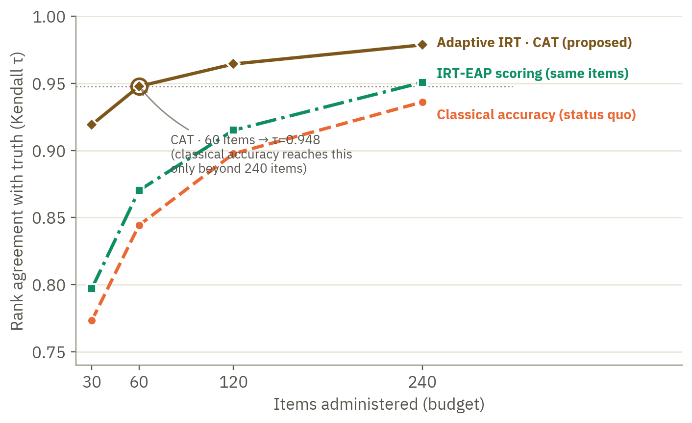
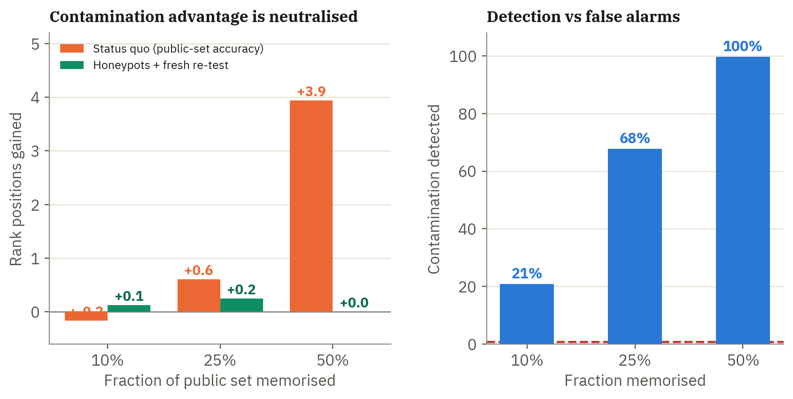
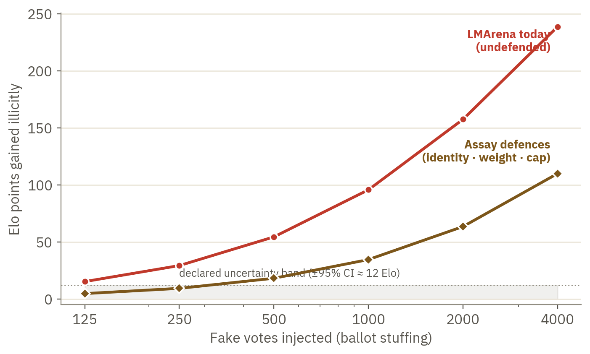

<div align="center">


<br/>

[](paper/Assay_Whitepaper_EN.pdf)
[](VERIFY.md)
[](poc/)
[](LICENSE)
[](LICENSE-PAPER.md)

**A Protocol for Verifiable AI Model Evaluation**<br/>
*Nicola Finazzi — Intelligent System S.r.l., Italy*

</div>

---

Public AI benchmarks have entered a trust crisis: test sets leak into training data,
leaderboards are gamed through selective reporting and vote manipulation, and the
organisations that grade frontier models are increasingly funded by the labs they rank.
**Assay** makes reliability *measurable*: adaptive psychometrics decides what a score
means, a pre-registration / commit–reveal protocol decides how a score is produced, and
a public tamper-evident ledger lets anyone re-derive any published number — including
against the operator itself.

<div align="center">

</div>

## Results, not promises

Every claim below is generated by the code in [`poc/`](poc/) (five-seed robustness;
master seed `20260818`) — the manipulation red-team runs on **57,477 real LMArena votes**.

| Reliability axis | Status quo | Assay proof of concept |
|---|---|---|
| Statistical efficiency | 240-item static test | same ranking fidelity with **~60 adaptive items** (τ = 0.948 vs 0.936) |
| Calibration honesty | no intervals published | **94–95%** empirical coverage of the declared 95% interval |
| Contamination resistance | **+3.9 ranks** from memorising half the test | **0.0 ranks** after honeypot detection + fresh re-test |
| Manipulation cost | ~41 anonymous votes ≈ €0 for +2 ranks | ≈ **€414** and ~687 verified identities to beat the uncertainty band |
| Verifiability | self-reported scores | **100%** of scores re-derivable from committed artefacts |

<details>
<summary><b>📈 Experiment 1 — ranking quality vs item budget</b></summary>
<br/>
<div align="center"></div>

Adaptive IRT reaches the fidelity of a 240-item static benchmark with roughly a quarter
of the items — less content to author, protect, and eventually retire.
</details>

<details>
<summary><b>🕵️ Experiment 2 — contamination neutralised</b></summary>
<br/>
<div align="center"></div>

A model that memorises half the public test gains +3.9 rank positions under classical
accuracy — and 0.0 under Assay's honeypot + fresh-probe defences (100% detection of
heavy contamination, 0.8% false alarms).
</details>

<details>
<summary><b>🗳️ Experiment 3 — manipulation red-team on real arena votes</b></summary>
<br/>
<div align="center"></div>

On the public LMArena corpus, ~41 anonymous votes move a mid-table model two ranks at
zero cost. Under identity-bound, weighted voting with confidence-band rankings, beating
the declared uncertainty band costs ≈ €414 across ~687 verified identities — and leaves
a permanent trace.
</details>

## 🔏 The blockchain signature

The canonical PDF is identified by its SHA-256 digest and timestamped on the
**Bitcoin blockchain** via [OpenTimestamps](https://opentimestamps.org)
(attested in block **963143**):

```
38dcf534194081c2efdb53b56ac0a7a4bf0fa528137997c6a65f90449f5603b2  Assay_Whitepaper_EN.pdf
```

Verify in ten seconds — drag `paper/Assay_Whitepaper_EN.pdf` and its `.ots` proof
onto [opentimestamps.org](https://opentimestamps.org), or see [VERIFY.md](VERIFY.md)
for the command-line route. A scheduled workflow keeps the proof upgraded automatically.
Any copy whose digest differs from the value above is not authoritative.

## Repository layout

```
paper/   whitepaper (canonical PDF) · OpenTimestamps proof · SHA256SUMS
poc/     measurement engine + the three experiments + raw results (JSON)
assets/  figures and the animated hallmark
```

## Reproduce

```bash
pip install numpy scipy pandas
cd poc
python3 exp_static.py     # experiments 1–2 (efficiency, contamination)
python3 exp_arena.py      # experiment 3 (needs duckdb + network for the vote corpus)
python3 robustness.py     # five-seed checks
```

Per the paper's disclosure policy (§10), operational parameters of the production
system — item content, decoy placement, flag thresholds — are withheld by design;
the reference implementation uses illustrative values.

## Citation

```bibtex
@techreport{finazzi2026assay,
  author      = {Finazzi, Nicola},
  title       = {A Protocol for Verifiable AI Model Evaluation},
  institution = {Intelligent System S.r.l.},
  year        = {2026},
  month       = {8},
  note        = {Working Paper v0.2. SHA-256 38dcf534…5603b2, Bitcoin-timestamped.}
}
```

## Licence

Code (`poc/`) under [MIT](LICENSE) · paper under [CC BY-NC-ND 4.0](LICENSE-PAPER.md).
“Assay” and the hallmark device are trade names of Intelligent System S.r.l.

<div align="center">
<sub>Nicola Finazzi · Intelligent System S.r.l. · Rovato (BS), Italy · 2026</sub>
</div>
